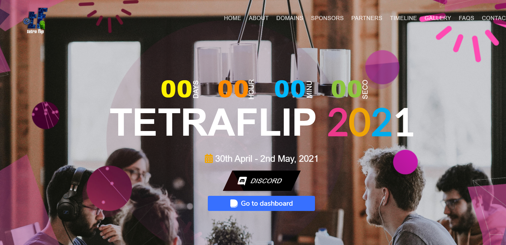
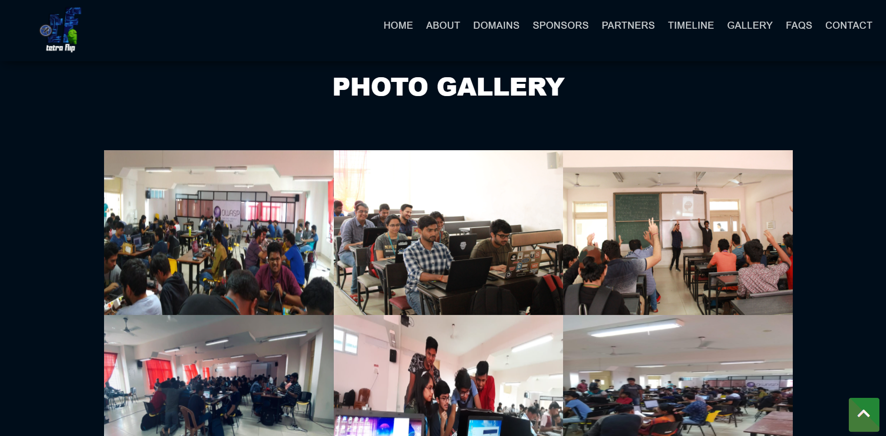
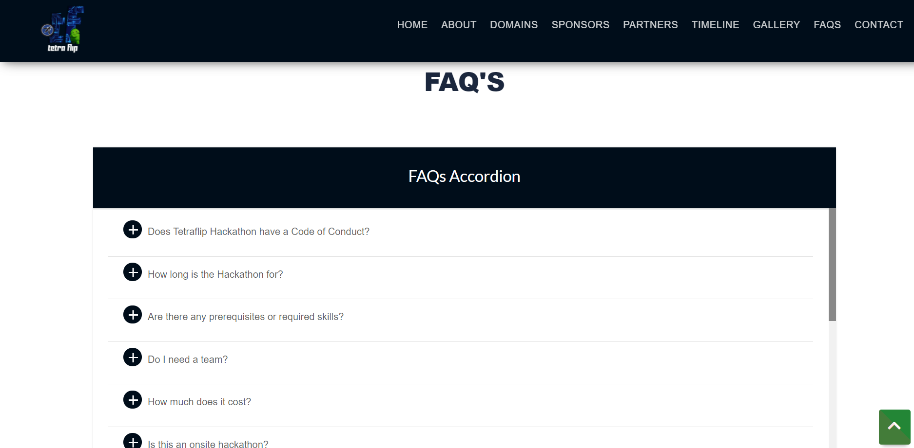
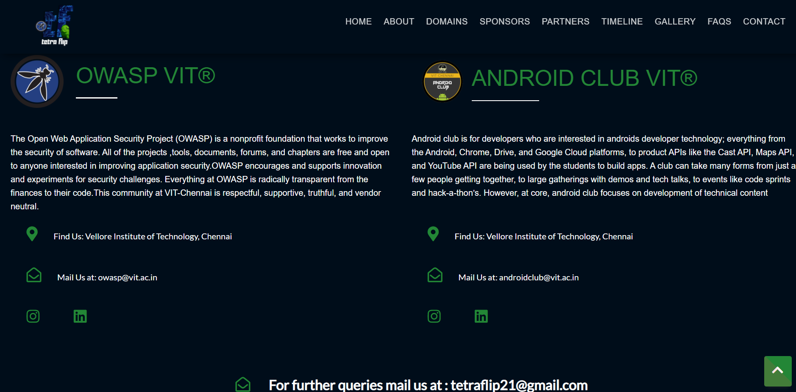

# TETRAFLIP 2021
## OFFICIAL SPONSOR - DEVFOLIO

Objectives:

- Largest Hackathon conducted by Android Club and OWASP Student Chapter of VIT Chennai.
- Our objective is to bring together talented students to compete over 48 hours to develop creative solutions for real-time problems.
- It is designed to spark innovation, attract and educate new talent and create new channels for collaboration between students and professionals
- TetraFlip promises to be an amazing event with the spirit of innovation and opportunities to bag Internships and to experience the tutelage of experienced mentors as you network with brilliant minds from around the globe.
- All the teams are required to submit their idea and domain during the registration. The selected team will participate in Round One

_**"The creation of something new is not accomplished by the intellect, but by the play instinct arising from inner necessity. The creative mind plays with the object it loves"**_

Domains:
- Industry
- Fintech
- Agriculture
- Healthcare
- Open Innovation
- Education
- Entertainment
- Safety & Security

Screenshots of Website: 

Official Tetraflip Website : <a href="https://tetraflip.owaspvit.com/">https://tetraflip.owaspvit.com/</a>

Our Team:
- [Apratim Shukla](https://github.com/apratimshukla6)
- [Aakash Ratha](https://github.com/aakashratha1006)
- [Nikhil Chapre](https://github.com/NikhilC2209)
- [Aditya Basta](https://github.com/BastaAditya)
- [Shrushti Singhania](https://github.com/shrushti2001)
- [Abishek Mahesh](https://github.com/abishek2001)
- [Vishal Nandagopal](https://github.com/vishalnandagopal)
- [Shaik Saheer Ahmed](https://github.com/saheerahmedsk)
- [Prateek Mohanty](https://github.com/prateekmohanty63)